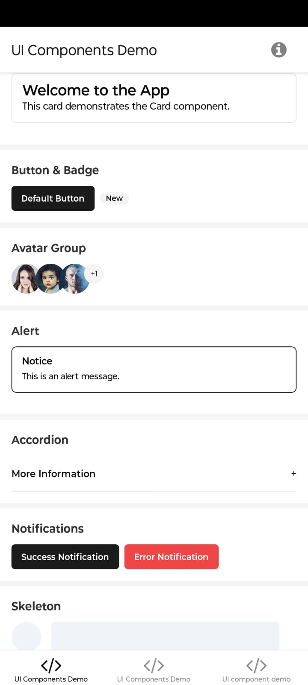
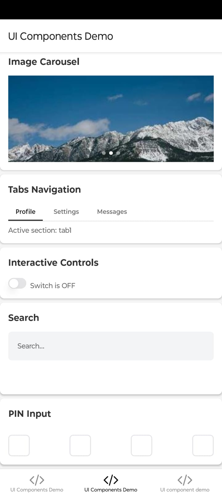
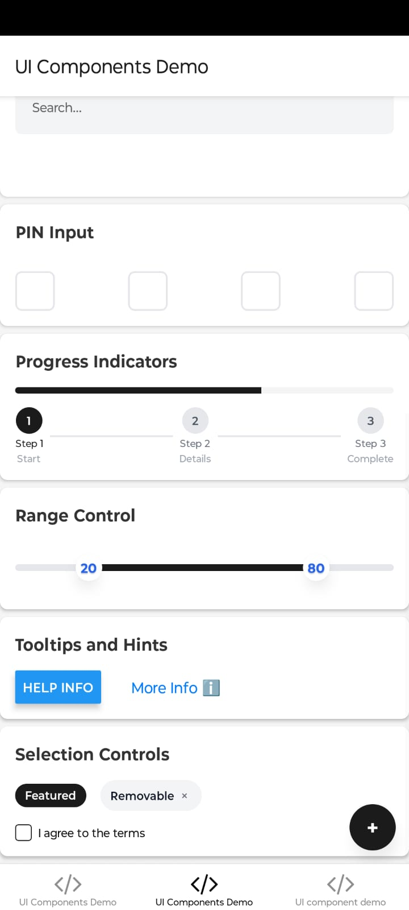
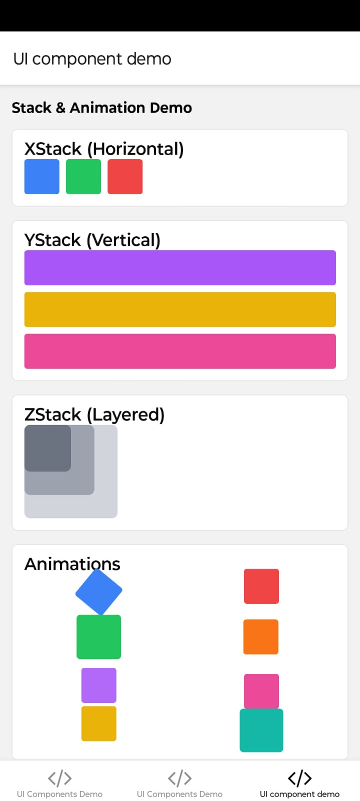

# RN-ShadUI

A comprehensive UI component library for React Native, inspired by shadcn/ui and built with NativeWind. This library provides highly customizable, accessible components with a native feel, perfect for building modern mobile applications.

> ⚠️ **Note:** This project is still under active development. Some components and features may be incomplete or subject to change.

> 💡 **Tip:** All components are designed to be copy-paste friendly! Feel free to copy any component into your project and customize it to match your needs. No complex setup required.

<div align="center">
  
  
  
  
</div>


## Features

- 🎨 20+ customizable UI components
- 📱 Native-first design approach
- 🎯 Full TypeScript support
- 🔄 Expo Router integration
- 💨 NativeWind (Tailwind CSS) styling
- ♿️ Accessibility focused

## Available Components

Our library includes the following components:

- **Feedback**
  - Alert
  - Dialog
  - Notification Badge
  - Progress
  - Progress Steps
  - Skeleton

- **Inputs**
  - Button
  - Checkbox
  - Floating Label Input
  - Form
  - Input
  - Pin Input

- **Layout**
  - Accordion
  - Card
  - Image Carousel
  - Pull to Refresh

- **Navigation**
  - Fab (Floating Action Button)

- **Data Display**
  - Avatar
  - Avatar Group
  - Badge
  - Chip

## Usage Examples

### Alert Component
```jsx
<Alert 
  title="Notice" 
  description="This is an alert message." 
  className="mb-4"
/>
```

### Accordion Component
```jsx
<AccordionItem title="More Information">
  <Text>This is the content inside the accordion.</Text>
</AccordionItem>
```

### Notifications
```jsx
<Button 
  variant="default" 
  onPress={handleSuccessNotification}
  className="mr-2"
>
  Success Notification
</Button>

<Button 
  variant="destructive" 
  onPress={handleErrorNotification}
  className="mr-2"
>
  Error Notification
</Button>
```

### Skeleton Loading
```jsx
<View className='flex-row mb-4'>
  <Skeleton
    className='h-12 w-12 rounded-full bg-slate-200 mr-4'
  />
  <Skeleton 
    className="h-12 w-[80%] bg-slate-200" 
  />
</View>
```

## Project Structure

```
rn-shadui/
├── app/                   # Expo Router screens
├── components/
│   └── ui/               # UI Components
│       ├── accordion
│       ├── alert
│       ├── animate
│       ├── avatar
│       ├── badge
│       ├── button
│       └── ... (other components)
├── assets/               # Images and static files
└── contexts/            # React Context providers
```

## Installation

```bash
# Clone the repository
git clone https://github.com/includeHasan/rn-shadui.git

# Install dependencies
npm install
```

## Development Setup

1. Install project dependencies:
```bash
npm install
```

2. Start the development server:
```bash
npm start
```

3. Run on your preferred platform:
```bash
# iOS
npm run ios

# Android
npm run android

# Web
npm run web
```

## Customization

All components are built with NativeWind, making them highly customizable. Example:

```jsx
// Custom styled button
<Button 
  className="bg-blue-500 hover:bg-blue-600 px-4 py-2 rounded-lg"
  variant="custom"
>
  Custom Button
</Button>
```

## Dependencies

- React Native v0.76.1
- Expo v52.0.6
- NativeWind (latest)
- TypeScript v5.3.3
- Expo Router v4.0.5
- React Navigation v6.1.7

## Contributing

1. Fork the repository
2. Create your feature branch (`git checkout -b feature/AmazingFeature`)
3. Commit your changes (`git commit -m 'Add some AmazingFeature'`)
4. Push to the branch (`git push origin feature/AmazingFeature`)
5. Open a Pull Request

## License

This project is licensed under the MIT License.

## Acknowledgments

- Inspired by [shadcn/ui](https://ui.shadcn.com/)
- Built with [NativeWind](https://www.nativewind.dev/)
- Created using [Expo](https://expo.dev/)

---

⭐️ If you find this project useful, don't forget to give it a star!
